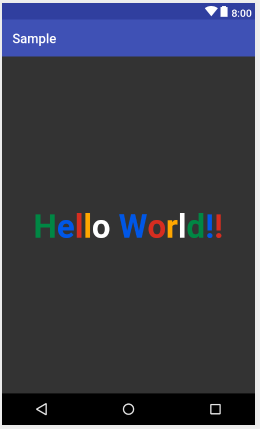
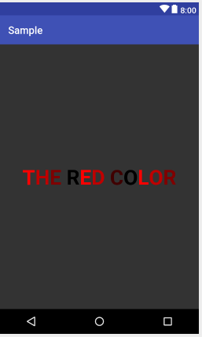
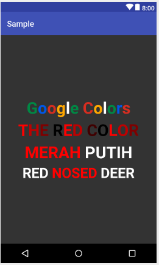

**MultiColorTextView** [  ](https://bintray.com/ha-yi/MultiColorTextView/MultiColorTextView/_latestVersion)
--

This is a simple library to display text with multicolor.







**How to Install**
---
Add to your app module `build.gradle`
```
compile 'com.lombokcyberlab.android.multicolortextview:MultiColorTextView:1.0.0'
```
or for gradle 3.x
```
implementation 'com.lombokcyberlab.android.multicolortextview:MultiColorTextView:1.0.0'
```

or maven add to your pom file:
```xml
<dependency>
  <groupId>com.lombokcyberlab.android.multicolortextview</groupId>
  <artifactId>MultiColorTextView</artifactId>
  <version>1.0.0</version>
  <type>pom</type>
</dependency>
```


Usage
---
**Using Color sheme**
```xml
<com.lombokcyberlab.android.multicolortextview.MultiColorTextView
        android:layout_width="wrap_content"
        android:layout_height="wrap_content"
        android:layout_centerInParent="true"
        app:text="Google Colors"
        app:colorScheme="google"
        app:textStyle="bold"
        app:textSize="40"/>
```

**Using Custom Colors**

First define your colors:

```xml
<string-array name="colorIndonesia">
        <item>#FF0000</item>
        <item>#FF0000</item>
        <item>#FF0000</item>
        <item>#FF0000</item>
        <item>#FF0000</item>
        <item>#FFFFFF</item>
        <item>#FFFFFF</item>
        <item>#FFFFFF</item>
        <item>#FFFFFF</item>
        <item>#FFFFFF</item>
        <item>#FFFFFF</item>
        <item>#FFFFFF</item>
    </string-array>
```

Then use it:
```xml
<com.lombokcyberlab.android.multicolortextview.MultiColorTextView
        android:layout_width="wrap_content"
        android:layout_height="wrap_content"
        android:layout_centerInParent="true"
        app:colors="@array/colorIndonesia"
        app:text="MERAH PUTIH"
        app:textSize="40"
        app:textStyle="bold" />
```

Available Options
---
Options       | Description  
--- | ---
`app:text` | Text to display 
`app:colors` | Array reference of colors
`app:colorScheme` | Use predefined color schemes.
`app:textSize` | Text Size
`app:textStyle` | only **bold** is available

 
Limitation
---
- Only displaying single line text (unwrapped).
- Limited color scheme
- one color in colors array for one character.

<a href="https://www.buymeacoffee.com/hayi" target="_blank"></a>
